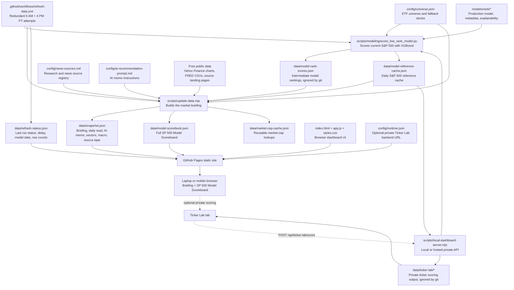

# Market Pulse

Market Pulse is a static market research dashboard for scheduled personal market reviews. It combines macro data, public market commentary, sector performance, and momentum screens into a hedge-fund-style research note, with redundant refresh attempts shortly after 5 AM and 4 PM Pacific.

The project is built to run cheaply with free data sources. It is not an intraday trading terminal and it is not financial advice.

## How It Works



## What It Does

- Summarizes the current market setup in a daily read.
- Screens S&P 500 constituents and a curated ETF universe for momentum setups.
- Scores current S&P 500 stocks with a production XGBoost learning-to-rank model.
- Publishes a full S&P 500 Model Scoreboard tab with every scored company ranked from highest model score to lowest.
- Tags top-ranked names by setup type, separating clean momentum from model-ranked rebound watches that are not yet momentum-confirmed.
- Shows a volatility-adjusted rebound activation price for high-ranked broken-trend names when the model likes the setup but price action still needs confirmation.
- Tracks sector performance using major sector ETF proxies.
- Pulls macro indicators from public FRED CSV endpoints.
- Scrapes a rolling macro calendar for market-moving events such as CPI, payrolls, PPI, GDP, PCE, and FOMC dates.
- After a scheduled official macro release has occurred, pulls the primary release page directly when a parser is configured. Employment Situation, CPI, PPI, GDP, and Personal Income/PCE pages are seeded, with targeted BLS parsers extracting jobs, inflation, internals, revisions, and market-relevant details.
- Ingests public research and commentary sources listed in `config/news-sources.md`.
- Discovers recent articles from source landing pages and RSS feeds, prioritizes newer dated articles, and builds a top-of-report market intelligence tape.
- Tracks professional market drivers, earnings calendars, earnings-linked daily movers, Yahoo Finance mover screens, and Reddit ticker attention as separate inputs.
- Optionally generates an AI Strategy Memo that combines article commentary, macro context, sector behavior, model rankings, and momentum data into structured research recommendations.
- Adds a Deeper Read section that uses AI to surface differentiated, thought-provoking source analysis from the last 7 days rather than generic daily market recaps.
- Enriches model candidates with company descriptions, market caps, investor relations links, earnings context, and recent ticker-specific news where free sources are available.
- Uses AI to draft the Daily Read executive snapshot, with deterministic model, sector, macro, and source-tape metrics as guardrails and fallback.
- Shows a Stay Away section based on the lowest-ranked model names and weakest sector clusters, framed as risk control rather than short-sale advice.
- Refuses to silently reuse stale model rankings or stale technical tape; the dashboard shows a visible data-status warning when fresh model or price data is unavailable.

## Live Site

The dashboard is designed to be published as a static GitHub Pages site:

```text
https://jhmona12.github.io/market-pulse/
```

The site reads from `data/snapshot.json` for the briefing and `data/model-scorebook.json` for the full S&P 500 Model Scoreboard. When those files change, the public page reflects the latest generated market snapshot after GitHub Pages redeploys.

Ticker Lab is visible on the public page, but scoring requires a separate private model API because GitHub Pages can only serve static files. The browser reads the API base URL from `config/runtime.json`.

## Freshness Guardrails

Market Pulse is designed to fail visibly rather than publish stale data as if it were current.

- The model scorer checks the latest price date before writing live ranks. By default, after 2 PM Pacific on a weekday it expects that trading day's close; before then it expects the prior business day; on weekends it expects the prior Friday. Set `EXPECTED_MARKET_DATA_DATE=YYYY-MM-DD` only when you intentionally need to override the expected close date.
- The model scorer also writes the dashboard technical tape: scoreboard trailing returns, 60-day beta, momentum stop-sell levels, market-strip ETFs, and sector ETF performance. The dashboard reuses that same fresh price pass instead of making a second large Yahoo request that can be rate-limited.
- `scripts/update-data.mjs` rejects stale `data/model-rank-scores.json` unless `ALLOW_STALE_MODEL_DATA=1` is explicitly set. If model data is stale or missing, model-ranked single-name recommendations are not generated from it.
- Fresh Yahoo chart history must be available through the expected close date before technical metrics are shown. If Yahoo is rate-limited or returns an old close, the dashboard does not reuse the prior snapshot's technical tape.
- When fresh price history is unavailable, the dashboard keeps news, macro, Reddit, earnings, and model context flowing where possible, but trailing return columns, sector tiles, and other technical fields are marked unavailable instead of showing stale values.
- The public dashboard includes a warning banner when price/technical data or model rankings are stale, missing, or unavailable.
- The private Ticker Lab refuses stale S&P 500 reference caches and rejects external tickers whose fetched price history is older than the current reference date.

## Local Use

This project has no required npm install step.

Start a local static server from the project root:

```bash
python3 -m http.server 4173
```

Then open:

```text
http://localhost:4173
```

For the private Ticker Lab, start the local API server instead:

```bash
npm run dev:local
```

Equivalent direct command:

```bash
node scripts/local-dashboard-server.mjs
```

Then open:

```text
http://localhost:4173
```

The Ticker Lab section is always visible. It can score tickers when it can reach either the same-origin local API from `npm run dev:local` or a hosted backend configured in `config/runtime.json`.

If port `4173` is already in use for the static server, choose another port:

```bash
python3 -m http.server 4174
```

For the local Ticker Lab API, set `PORT`:

```bash
PORT=4174 npm run dev:local
```

## Refreshing Data

GitHub Actions runs the full refresh from `.github/workflows/refresh-data.yml`. Because GitHub's scheduled runner is best-effort and can delay or drop individual scheduled runs, the workflow covers each target window plus the following Pacific hour: shortly after 5 AM Pacific and 4 PM Pacific, with 30-minute backup attempts. The workflow checks `data/refresh-status.json` before doing work and refreshes only once per Pacific morning/evening window.

Run the refresh script:

```bash
node scripts/update-data.mjs
```

The refresh script:

- Reads source URLs from `config/news-sources.md`
- Fetches source landing pages and discovers likely research/commentary articles
- Extracts article titles, summaries, excerpts, and publication dates when available
- Parses RSS feeds when a source exposes cleaner structured headlines than a static landing page
- Requires source articles to have a publication date within the freshness window, 30 days by default, before they can appear in the Source Tape or feed the AI/source briefing
- Builds `marketIntelligence` with rolling 24-hour professional drivers, important older context, earnings movers, market movers, and Reddit sentiment
- Treats Reddit / WallStreetBets as attention and sentiment only, separated from professional commentary
- Reuses the fresh technical tape exported by `scripts/modeling/score_live_rank_model.py`; if that tape is unavailable and Yahoo chart history is temporarily rate-limited, stale technical values are left unavailable while sources, earnings, Reddit, macro, and eligible model context continue to refresh
- Pulls S&P 500 constituents from Wikipedia when available
- Adds ETFs from `config/universe.json`
- Fetches delayed/end-of-day chart history from Yahoo Finance's public chart endpoint
- Pulls selected macro series from FRED
- Refreshes `data/macro-calendar.json` with the next six months of macro release dates from FRED release calendars, BEA's release schedule, and the Fed's FOMC calendar
- Pulls same-day or recent official macro releases from primary-source pages once scheduled releases have occurred
- Computes momentum, trend, breadth, RSI, volume, and relative-strength metrics
- Reads `data/model-rank-scores.json` when available and promotes the XGBoost model rank as the primary single-name score
- Adds setup tags from the model scorer, including `Momentum Confirmed`, `Model Rebound Watch`, and `Not Momentum Confirmed`
- Adds a rebound activation price for qualifying rebound-watch names, calculated as current close plus `0.75 x 20-day realized daily volatility`
- Adds a stop-sell price for all current top-decile model names, plus other surfaced non-confirmed model candidates, during the model scorer's fresh price-history pass so the briefing builder does not make a second Yahoo request for the same names
- Writes `data/model-reference-cache.json` during the model scoring step so ad hoc Ticker Lab requests can reuse the daily S&P 500 reference universe
- Re-scores the same fresh S&P 500 feature cache with the tuned 252-day model so `data/long-horizon-research.json` can show a full searchable Long-Horizon Book without making a second Yahoo history pass
- Writes fresh market-strip and sector-performance rows during the model scoring step so the dashboard has complete technical sections even when the later briefing builder avoids another large price-history fetch
- Writes `data/model-scorebook.json` with every model-scored S&P 500 company, including rank, company metadata, market cap, model score, percentile, 60-day beta to SPY, trailing 7D, 14D, 30D, 60D, 90D calendar-lookback returns, and YTD return when fresh price history is available
- Updates `data/market-cap-cache.json` from free public quote data and reuses recent values to keep the daily job reliable
- Enriches the top model candidates with company context from Nasdaq, company investor relations pages, and Yahoo Finance news RSS
- Builds a lowest-ranked model book for the Stay Away section
- Writes the dashboard snapshot to `data/snapshot.json`

To refresh model rankings before the dashboard snapshot:

```bash
.venv-model/bin/python scripts/modeling/score_live_rank_model.py --output data/model-rank-scores.json
.venv-model/bin/python scripts/modeling/score_live_rank_model.py \
  --model-dir models/long-horizon \
  --model-name xgboost_rank_sector252_15y_monthly_tuned_research \
  --output data/model-rank-scores-long-horizon.json \
  --reference-cache data/model-reference-cache.json \
  --score-reference-cache
node scripts/update-data.mjs
```

Or run both model scoring passes with:

```bash
npm run score:models
```

`data/model-rank-scores.json` and `data/model-rank-scores-long-horizon.json` are intermediate files and are ignored by git. The generated `data/snapshot.json` contains the briefing data needed by the static site. The generated `data/model-scorebook.json` powers the public scoreboard tab. The generated `data/long-horizon-research.json` powers the Long-Horizon Book tab. The generated `data/model-reference-cache.json` is intentionally committed because it gives the private Ticker Lab and the long-horizon scoring pass a fresh daily S&P 500 baseline without rebuilding the full universe on every request.

Some current constituents may be fetched but not scored if they do not have enough clean trailing data to populate every required feature. The scorer records those symbols in the snapshot model metadata.

For a faster test run:

```bash
SKIP_AI=1 MAX_TICKERS=80 SNAPSHOT_OUTPUT=data/snapshot.dev.json node scripts/update-data.mjs
```

Useful source-ingestion knobs:

```bash
SOURCE_ARTICLES_PER_SOURCE=3
SOURCE_ARTICLE_CANDIDATES=10
COMPANY_CONTEXT_COUNT=12
```

## AI Strategy Memo

The AI layer is optional. If `OPENAI_API_KEY` is available, the refresh script calls the OpenAI Responses API and writes structured AI output into `data/snapshot.json`.

The intended division of labor is:

- The XGBoost rank model is the deterministic stock-selection engine.
- The Python model scorer owns price history, technical features, ETF confirmation, stop levels, activation levels, and scorebook rows.
- The AI Strategy Memo explains the model-ranked candidates against the macro calendar and public source tape.
- Same-day official macro releases are fed into the AI context separately from the future calendar, so a released payrolls/CPI/PPI/GDP/PCE report can drive the Daily Read before research publications have reacted.
- The Daily Read is AI-written when available, but it is anchored to deterministic facts and falls back to a deterministic executive snapshot if the AI call fails.
- The Daily Read is deterministic by default so the top of the report stays tightly grounded in the source tape, earnings movers, Reddit attention, macro calendar, and model facts. Set `AI_DAILY_READ=1` to let AI write the Daily Read when its output passes local fact-language guardrails.
- The Deeper Read section asks the AI to choose the most interesting non-obvious source analysis from the last 7 days, explain the second-order market implication, and avoid repeating sources used in the prior refresh when enough alternatives exist. Rotation memory is stored in `data/deeper-read-history.json`.
- The Stay Away section is seeded deterministically from the lowest-ranked model names; AI may add concise commentary, but it cannot choose symbols outside that supplied avoid-candidate list.

Create a local `.env` file:

```bash
OPENAI_API_KEY=your_api_key_here
OPENAI_MODEL=gpt-5-nano
```

The default model is `gpt-5-nano`, chosen for low-cost summarization and synthesis. The prompt can be edited in:

```text
config/ai-recommendation-prompt.md
```

The AI recommendation schema is intentionally constrained:

- When model candidates are available, recommendations must use symbols from the model-ranked candidate list.
- Ticker spelling must match the supplied data.
- Each recommendation includes model evidence such as rank, percentile, and model reasons.
- Each recommendation includes a short company overview, market cap, earnings context, and a recent-news/catalyst read when company context is available.
- The AI prompt tells the model to prefer investor relations pages as the primary company source, use Nasdaq for earnings data when dates are machine-readable, and avoid overstating news causality.
- The prompt tells the model to surface source-mentioned current events such as geopolitical conflict, oil shocks, sanctions, shipping disruption, elections, policy shifts, credit stress, and central-bank communication when those events are relevant to market behavior.
- The prompt tells the model to prioritize primary-source macro releases over commentary when the official release has already occurred, including the actual result, revisions, internals, and market implication.
- Each recommendation must connect macro/publication evidence with technical momentum evidence.
- Recommendations include setup, why-now, macro evidence, technical evidence, risk, and invalidation.
- The Stay Away output must use only supplied lowest-ranked model names, preserve metric-specific model evidence, and explain what would need to improve before those names deserve fresh long exposure.
- Source references use source IDs from the ingested article tape when article data is available.

If no API key is configured, the dashboard still works with the model-ranked Daily Read, Desk Calls, Momentum Book, Sector Performance, Macro Pulse, and Source Tape.

AI usage estimates are written into `data/snapshot.json`; local usage logs are written to `data/usage-log.jsonl`, which is ignored by git.

## Source Registry

Add or edit research sources in:

```text
config/news-sources.md
```

The file is a markdown table with this shape:

```text
| Name | URL | Category | Cadence | Trust | Notes |
```

Good source candidates include:

- Public market commentaries
- Research landing pages
- Institution blogs
- Official economic release calendars
- Stable pages with dated article metadata

Some sites block automated requests or hide publication data. In those cases, the source may appear as failed or may show an article without a date. That is expected behavior for free, public web sources.

## Momentum Screen

The screener ranks S&P 500 stocks and selected ETFs using end-of-day technical metrics, including:

- Price versus 20-day, 50-day, 100-day, and 200-day moving averages
- Recent moving-average crossovers
- 20-day and 60-day returns
- Relative strength versus SPY
- RSI
- Volume versus 20-day average
- Proximity to recent highs

The dashboard displays the top model-ranked and rules-confirmed momentum names directly. Screening thresholds live in the refresh code/model pipeline rather than in a floating UI control.

### Rebound Watch Tags

The XGBoost model can rank a company highly even when its chart is not a clean momentum setup. For example, a stock may be deeply oversold, volatile, and below major moving averages, but still show an attractive short-term sector-relative rebound profile.

To avoid confusing those names with true momentum, the scorer classifies setups:

- `Momentum Confirmed`: top-decile model rank, above the 50D and 200D moving averages, and positive 20D and 60D returns. RSI is retained as a risk/extension signal, but it does not disqualify an otherwise confirmed momentum setup.
- `Model Rebound Watch`: top-decile model rank, below the 50D and 200D moving averages, and negative 20D and 60D returns.
- `Not Momentum Confirmed`: high model rank with mixed or weak trend confirmation.

For `Model Rebound Watch` names, the dashboard shows an activation level:

```text
activation price = current close x (1 + 0.75 x 20D realized daily volatility)
activation window = 5 trading days
confirmation = close above the activation price
```

This is an activation price, not a guaranteed buy price. If the stock does not close above that level within the window, the setup should be refreshed and reassessed.

The supporting research and backtest are documented in:

```text
docs/rebound-activation-research.md
```

### Stop-Sell Discipline

For current top-decile model names, `Momentum Confirmed` names, and surfaced `Not Momentum Confirmed` candidates, the dashboard can show one compact stop label:

```text
Stop: $123.45
```

The rule is close-based: exit on an end-of-day close below the stop. The level is calculated during the daily refresh from fresh adjusted daily price history using a balanced ATR/chandelier method:

```text
raw stop = max(
  22D highest high - 3.0 x ATR(22),
  50D moving average - 0.5 x ATR(20),
  20D lowest low - 0.25 x ATR(20)
)

final stop = raw stop clamped between 1.5x and 4.0x ATR(20) below the latest close
```

This is meant to keep the UI action-oriented while keeping the rationale outside the main dashboard. The methodology is documented in:

```text
docs/stop-sell-methodology.md
```

The stop calculation is generated by the Python model scorer during the same fresh price-history pass used for model ranks, trailing returns, beta, market-strip rows, and sector performance. The static dashboard only renders the exported stop value.

## Private Ticker Lab

Ticker Lab scores pasted tickers against the current S&P 500 reference universe.

The dashboard accepts symbols separated by spaces, commas, semicolons, tabs, or new lines. The browser sends the cleaned symbols to:

```text
POST /api/ticker-lab/score
```

The local server runs:

```bash
.venv-model/bin/python scripts/modeling/score_live_rank_model.py --focus-symbols "AAPL,TSM"
```

The scorer:

- Uses `data/model-reference-cache.json` when available for the daily S&P 500 reference scores
- Fetches pasted non-reference tickers plus SPY and sector ETFs for live focus-ticker context
- Falls back to rebuilding the full S&P 500 reference universe if the cache is unavailable or invalid
- Scores the focus tickers with the same production XGBoost rank model
- Compares each focus ticker's model score against the S&P 500 reference scores
- Returns S&P rank, percentile, model score, trend, RSI, relative return versus SPY, sector context, model reasons, and risk flags
- Infers a sector proxy for non-S&P tickers using trailing return correlation to SPDR sector ETFs

Ticker Lab output is written under `data/ticker-lab/`, which is ignored by git and blocked from static web serving by the local/backend server.

For public-site use, deploy the backend from this repo with the included `Dockerfile` or `render.yaml`, then put the backend origin in:

```json
{
  "tickerLabApiBaseUrl": "https://your-private-backend.example.com"
}
```

If `TICKER_LAB_ACCESS_CODE` is set on the backend, the site shows an access-code field and sends that value in the `x-ticker-lab-token` header. This keeps the public page viewable while keeping model scoring private. Without an access code, the local server only allows scoring from localhost; hosted/non-local requests fail closed unless `TICKER_LAB_ALLOW_OPEN=1` is intentionally set.

Suggested backend deployment flow:

1. Deploy the repo as a Docker web service using `render.yaml` or the `Dockerfile`.
2. Set `TICKER_LAB_ACCESS_CODE` as a private environment variable in the hosting dashboard.
3. After the host gives you a URL, update the public runtime config:

```bash
node scripts/configure-ticker-backend.mjs https://your-backend.example.com
git add config/runtime.json
git commit -m "Configure Ticker Lab backend"
git push
```

Do not put the access code in `config/runtime.json`; that file is public because the browser has to read it.

Important caveat: non-U.S. and exchange-suffix tickers may be less comparable to S&P 500 stocks because currency, trading calendar, market hours, and volume conventions can differ.

## Scheduled Refresh

The repository includes a GitHub Actions workflow at:

```text
.github/workflows/refresh-data.yml
```

It is configured to refresh twice daily shortly after 5 AM Pacific and 4 PM Pacific, with a one-hour-later Pacific backstop for each target window. Because GitHub cron runs in UTC, the workflow schedules `12:11/12:41`, `13:11/13:41`, and `14:11/14:41` UTC for the morning window, plus `23:11/23:41`, `00:11/00:41`, and `01:11/01:41` UTC for the afternoon window. The alternate UTC hours cover daylight saving and standard time; the Pacific-time gate only runs slots whose intended scheduled time maps to either the target hour or the following backstop hour in `America/Los_Angeles`. The guard evaluates the scheduled slot rather than the delayed runner start time, so a late GitHub runner does not accidentally skip the refresh.

The schedule intentionally avoids minute `0`. GitHub documents that scheduled workflows may be delayed during high-load periods, especially at the start of every hour, and that queued scheduled jobs can be dropped. Running at minutes `11` and `41` gives each active hour a backup attempt while keeping the schedule easier to audit.

When the refresh runs successfully, it:

- Regenerates `data/macro-calendar.json` before the dashboard snapshot so macro dates are not hand-keyed
- Scores the current S&P 500 universe with the committed XGBoost rank model when dependencies and free data endpoints are available
- Refreshes `data/model-reference-cache.json` for fast Ticker Lab scoring
- Regenerates `data/snapshot.json`
- Regenerates `data/model-scorebook.json` and `data/market-cap-cache.json`
- Updates `data/deeper-read-history.json` so the next AI Deeper Read can avoid repeating the same source mix when enough alternatives exist
- Writes `data/refresh-status.json` with the scheduled time, actual runner start time, delay, run URL, status, model date, and row counts
- Commits the updated snapshot, scorebook, refresh status, market-cap cache, and reference cache back to `main` if any changed
- Deploys GitHub Pages directly from the refresh workflow so dashboard updates do not depend on a second workflow being triggered by a bot commit
- Skips its own commit/deploy cleanly if `main` advanced while a delayed refresh was running, which prevents an older scheduled run from overwriting a newer manual refresh

If model scoring fails, the workflow writes a failure status and deploys that diagnostic file with the last available dashboard data instead of silently publishing a model-less "success" snapshot.

GitHub scheduled workflows may start late; GitHub does not guarantee exact cron start time. Manual refreshes can also be triggered from the Actions tab with `workflow_dispatch`.

Diagnostic status is published at:

```text
https://jhmona12.github.io/market-pulse/data/refresh-status.json
```

Important implementation note: pushes made by GitHub's default `GITHUB_TOKEN` do not trigger other workflows. The refresh workflow therefore performs its own Pages deployment after writing data. The separate Pages workflow remains useful for normal human-authored pushes.

## Modeling Pipeline

The repo includes a separate Python modeling workflow for researching S&P 500 momentum signals. Raw history, research models, predictions, and reports are ignored by git. The production rank model and compact explainability artifact are exported separately into `models/rank/` so GitHub Actions and the static dashboard can use them.

There are two intentionally separate model families:

- **14-day tactical rank model:** production dashboard model for short-term model-ranked momentum and rebound setups.
- **252-day long-horizon rank model:** dashboard research model for one-year holding candidates. It reuses shared feature engineering, but has separate labels, datasets, reports, and model names.

The current primary dashboard model is an XGBoost learning-to-rank model. It is designed to answer a daily portfolio-selection question: which current S&P 500 stocks look most likely to outperform their sector over the next 14 trading days?

### Label

For every feature-complete stock/date row:

- Entry is assumed at the next trading day's close, not the same-day close.
- Exit is assumed 14 trading days later.
- The stock's forward return is compared with the matching sector ETF's forward return.
- A 15 bps round-trip cost is subtracted from the sector-neutral return.
- Stocks are ranked within each date by that after-cost sector-neutral return.
- The rank label is a daily `0-4` relevance grade: top decile `4`, next decile `3`, middle `2`, second-worst decile `1`, bottom decile `0`.

In plain English, the model is not trying to forecast the exact stock price. It is trying to sort the daily universe so the top-ranked basket contains stocks with better near-term sector-relative momentum setups than the bottom-ranked basket.

### Production Dashboard Artifacts

The dashboard uses these committed artifacts:

```text
models/rank/xgboost_rank_sector14_tuned.json                 Production XGBoost rank model
models/rank/xgboost_rank_sector14_tuned_metadata.json        Feature list, target, training window, and parameters
models/rank/xgboost_rank_sector14_tuned_explainability.json  Compact SHAP-style feature explanation
```

The production model is exported from the feature-complete training dataset:

```bash
.venv-model/bin/python scripts/modeling/export_production_rank_model.py --num-boost-round 25
```

The current SHAP-style explainability artifact was generated from the tuned holdout model. It stores the highest-impact features by mean absolute contribution, which can be surfaced in the dashboard and AI prompt as model context.

Legacy/research labels still exist for comparison:

- `label_outperform_spy_14d`: stock 14-day return minus SPY return `> 0`.
- `meta_label_momentum_success`: candidate-only success label using a return hurdle and drawdown floor.

### Long-Horizon Research Model

The 252-day model powers a separate `Long-Horizon Book` dashboard tab. It answers a different question from the tactical model: which current S&P 500 names look attractive enough to hold through a roughly one-year window?

The long-horizon dataset is built with:

```bash
.venv-model/bin/python scripts/modeling/build_long_horizon_dataset.py
```

It writes ignored local artifacts under `data/modeling/`:

```text
data/modeling/features/long_horizon_training_dataset.csv.gz
data/modeling/features/long_horizon_training_dataset_metadata.json
data/modeling/models/xgboost_rank_sector252_research.json
data/modeling/reports/xgboost_rank_sector252_*
models/long-horizon/xgboost_rank_sector252_research.json
models/long-horizon/xgboost_rank_sector252_research_metadata.json
models/long-horizon/xgboost_rank_sector252_research_explainability.json
models/long-horizon/xgboost_rank_sector252_15y_monthly_tuned_research.json
models/long-horizon/xgboost_rank_sector252_15y_monthly_tuned_research_metadata.json
models/long-horizon/xgboost_rank_sector252_15y_monthly_tuned_research_explainability.json
models/long-horizon/xgboost_rank_sector252_15y_monthly_tuned_baseline_comparison.json
models/long-horizon/xgboost_rank_sector252_walk_forward_baseline_comparison.json
models/long-horizon/xgboost_rank_sector252_drawdown_adjusted_walk_forward_baseline_comparison.json
models/long-horizon/long_horizon_label_comparison.json
data/long-horizon-research.json
```

The `data/modeling/` files are ignored local research outputs. The `models/long-horizon/` files are small committed research artifacts. `data/long-horizon-research.json` is the compact dashboard-facing export. These are separate from the dashboard's `models/rank/` production artifacts.

The long-horizon label is deliberately named with a `252d` suffix:

```text
target column: relevance_grade_sector_neutral_252d
return column: sector_neutral_forward_return_252d_after_cost
entry: next trading day's adjusted close
exit: 252 trading days after entry
benchmark: matching sector ETF over the same entry/exit window
```

The experimental drawdown-adjusted label is also generated:

```text
target column: relevance_grade_drawdown_adjusted_252d
return column: drawdown_adjusted_sector_neutral_return_252d_after_cost
method: sector-neutral 252D return plus 0.5x clipped relative forward max drawdown
```

Plain English: it rewards one-year outperformance that arrives with a smoother path versus the sector. Current testing says this improves drawdown modestly, but gives up too much actual return, so it remains a diagnostic label rather than the primary label.

The model uses the same 156 shared price, liquidity, volatility, relative-strength, sector, and market-context features as the 14-day model. It does not reuse the 14-day target, 14-day reports, or production dashboard artifact names.

Promoted long-horizon method:

```text
raw price cache: about 20 years
labeled dataset window: 2012-05-23 to 2025-05-19
exported model training window: 2012-05-23 to 2025-05-01
train/validation sampling: monthly
exported model training rows: 70,734 across 157 monthly sampled dates
exported model parameters: eta 0.025, max_depth 2, min_child_weight 80, subsample 0.90, colsample_bytree 0.85
exported boost rounds: 60
test evaluation: full daily windows, summarized with monthly and quarterly cohorts
target: relevance_grade_sector_neutral_252d
```

Why this was selected:

- The 252-trading-day label makes neighboring daily rows highly overlapping, so monthly train/validation sampling reduces duplicate training information.
- The 15-year labeled window keeps more history than the original 10-year baseline without leaning as hard on older regimes where market structure and current-S&P survivor bias are more concerning.
- In the window/sampling comparison, 15-year monthly training had the strongest monthly and quarterly median top-decile returns.
- A targeted hyperparameter tuning pass then favored a shallower, lower-learning-rate model over the inherited default settings.

```text
Run                  Sample    Monthly median   Quarterly median
10y baseline         daily        +35.84%          +34.56%
15y                 daily        +27.98%          +23.50%
15y                 weekly       +27.03%          +25.97%
15y                 monthly      +36.49%          +37.24%
20y                 daily        +16.22%          +16.22%
20y                 weekly       +26.11%          +26.11%
20y                 monthly      +28.59%          +27.09%
```

Initial 10-year local research dataset:

```text
Rows:        963,047
Symbols:     501
Date range:  2017-05-04 to 2025-04-29
Features:    156
```

The labeled date range ends earlier than the raw price cache because every row needs a full 252-trading-day future path.

Initial long-horizon walk-forward command:

```bash
.venv-model/bin/python scripts/modeling/walk_forward_rank_model.py \
  --dataset long_horizon_training_dataset.csv.gz \
  --model-name xgboost_rank_sector252_walk_forward \
  --target-column relevance_grade_sector_neutral_252d \
  --return-column sector_neutral_forward_return_252d_after_cost \
  --folds 2 \
  --test-days 252 \
  --validation-days 252 \
  --embargo-days 252 \
  --min-train-days 700 \
  --num-boost-round 300 \
  --early-stopping-rounds 25
```

Initial research results were directionally strong but should be treated as research-grade because the universe uses current S&P 500 constituents and one-year labels overlap heavily inside each daily test window:

```text
Combined top-decile 252D sector-neutral return: +38.94%
Top-decile hit rate:                             58.9%
Top-minus-bottom 252D spread:                    +41.16%
Monthly cohort median top-decile return:         +37.34%
Quarterly cohort median top-decile return:       +32.24%
```

Drawdown-adjusted label comparison on the same walk-forward rows:

```text
Primary sector-neutral label:
  Daily mean actual return:       +38.94%
  Daily median actual return:     +35.42%
  Quarterly median actual return: +34.56%
  Mean forward max drawdown:      -19.82%

Drawdown-adjusted label:
  Daily mean actual return:       +21.84%
  Daily median actual return:     +16.86%
  Quarterly median actual return: +19.73%
  Mean forward max drawdown:      -17.39%
```

The efficient tuning pass used the 15-year monthly dataset, monthly train/validation sampling, two recent one-year folds for the wider preset screen, and a four-fold confirmation run for the winning preset versus the inherited default. The selected preset is intentionally conservative: shallower trees, lower learning rate, and stronger dependence control from monthly sampling. It is an incremental improvement, not a clean sweep: the tuned preset improved daily mean return, hit rate, and quarterly median return in the confirmation run, while the prior default retained a slightly better monthly median and quarterly spread.

```text
Selected preset:                       depth2_more_rounds
Parameters:                            eta 0.025, max_depth 2, min_child_weight 80
Two-fold screen daily top-decile mean:  +39.45%
Two-fold monthly median top decile:     +37.41%
Four-fold daily top-decile mean:        +30.63%
Four-fold monthly median top decile:    +22.35%
Four-fold quarterly median top decile:  +26.66%
Four-fold top-minus-bottom spread:      +32.75%
Median best iteration, four folds:      27.5
Exported fixed boosting rounds:         60
```

SHAP-style explainability for the research model is stored in:

```text
data/modeling/reports/xgboost_rank_sector252_15y_monthly_tuned_research_shap_summary.csv
data/modeling/reports/xgboost_rank_sector252_15y_monthly_tuned_research_shap_summary.json
models/long-horizon/xgboost_rank_sector252_15y_monthly_tuned_research_explainability.json
```

The current SHAP read is important: the tuned one-year model is mostly sorting on illiquidity, volatility, and risk-regime features. The largest feature by mean absolute SHAP is `amihud_20d_pct_rank`, followed by volatility measures versus the universe, sector, and SPY. That does not mean the model is useless; it means the current model should be understood as a risk/liquidity-aware long-horizon ranker rather than a pure momentum model.

The long-horizon model is now compared against simple rule-based baselines with:

```bash
.venv-model/bin/python scripts/modeling/evaluate_rank_baselines.py \
  --dataset long_horizon_training_dataset_15y.csv.gz \
  --predictions xgboost_rank_sector252_15y_monthly_tuned_walk_forward_test_predictions.csv \
  --output-name xgboost_rank_sector252_15y_monthly_tuned_baseline_comparison \
  --artifact-output models/long-horizon/xgboost_rank_sector252_15y_monthly_tuned_baseline_comparison.json \
  --metadata-artifact models/long-horizon/xgboost_rank_sector252_15y_monthly_tuned_research_metadata.json
```

Walk-forward baseline comparison:

```text
Strategy                     Daily mean   Monthly median   Quarterly median
XGBoost rank model           +30.64%      +22.05%          +25.04%
Sector-relative momentum     +18.87%      +15.06%          +10.98%
12-1 month momentum          +18.36%      +16.12%          +15.91%
Technical composite          +10.38%       +6.39%           +6.39%
Low volatility                -1.66%       -2.23%           -1.91%
```

The tuned XGBoost ranker is beating the simple baselines in this four-fold test, but sector-relative momentum remains the key benchmark to keep watching. The dashboard presents this as a separate Long-Horizon Book with full search/filter controls, 14-day tactical agreement labels, sector/cap mix context, and compact diagnostics. It is not part of the 14-day Momentum Book.

Before treating this model as production-grade portfolio advice, review point-in-time constituent bias, keep expanding monthly/quarterly cohort monitoring, and consider adding fundamentals such as valuation, profitability, leverage, and growth.

### Universe And Null Treatment

- Universe: current S&P 500 constituents for training/scoring.
- Price history: about 10 years of cached daily adjusted-close history from free public endpoints.
- Short-history current constituents are kept by default once they have enough trailing data to compute every required feature and enough future data to compute the label.
- Nulls are not imputed. Rows with missing required features, infinite values, or missing labels are dropped from the training dataset.
- Macro/FRED observation-date fields are excluded by default because observation dates are not the same thing as market release dates.

The current feature-complete dataset has `1,082,323` rows, `502` symbols, `156` features, zero feature null cells, and zero label mismatches. Most symbols have full coverage: `449` of `502` have more than 95% of the available post-feature history. The shortest histories are mostly spin-offs, IPOs, or newer S&P additions such as `SNDK`, `GEV`, `SOLV`, `VLTO`, `KVUE`, `GEHC`, `CEG`, `HOOD`, `APP`, and `COIN`.

For the long-horizon model specifically, `scripts/modeling/audit_long_horizon_history.py` currently finds `501` feature-complete symbols out of `503` current constituents and an earliest clean labeled date of `2017-05-04` with the current 10-year raw price cache. The point-in-time universe audit is free-source only: `scripts/modeling/build_sp500_point_in_time_universe.py` parses Wikipedia current constituents plus index changes and found `357` change rows, but removed-name intervals remain incomplete and are not forced into training.

Fundamentals are audit-first. `scripts/modeling/audit_sec_fundamentals.py` tests official SEC Company Facts coverage and aligns future feature work around filing dates rather than fiscal period dates. A 25-name smoke test matched all 25 sampled constituents with zero request failures, but fundamentals are not wired into daily refresh until coverage and reliability are reviewed.

Minimum-history filters are available for research:

```bash
.venv-model/bin/python scripts/modeling/walk_forward_rank_model.py --min-symbol-rows 756
```

Recent sensitivity tests argued against removing short-history names by default:

```text
No minimum filter:     +2.75% top-decile return, 58.1% hit rate, +3.45% spread
Minimum ~2 years:      +2.51% top-decile return, 56.6% hit rate, +2.86% spread
Minimum ~3 years:      +2.31% top-decile return, 56.0% hit rate, +2.75% spread
Minimum ~5 years:      +2.31% top-decile return, 56.3% hit rate, +2.93% spread
Minimum ~7 years:      +2.18% top-decile return, 57.3% hit rate, +2.78% spread
```

### Features

The model intentionally excludes article/news features for now. The current feature set focuses on price-derived and cross-sectional signals:

- Momentum and trend: 20-day, 60-day, 120-day, skip-window 126-day and 252-day momentum, moving-average distance, and 52-week high/low distance.
- Risk and volatility: 20-day and 60-day volatility, downside volatility, beta to SPY, max daily return, and volatility relative to sector/SPY.
- Liquidity: volume ratios, dollar volume, and Amihud-style illiquidity.
- Relative strength: stock returns versus SPY, sector ETF, sector median, and same-day cross-sectional ranks.
- Market context: S&P breadth, SPY trend/volatility, sector ETF momentum, and sector ETF trend.

Feature and target definitions live in:

```text
scripts/modeling/schema.py          Label names, non-feature columns, and ablation groups
scripts/modeling/model_features.py  Shared train/live feature list and cross-sectional transforms
```

Keeping the shared model features in one module reduces train/live drift between the historical dataset builder and the daily scorer.

### Evaluation

The main evaluation is an embargoed walk-forward test:

- 4 recent non-overlapping test folds.
- 63 trading days per test fold.
- 126 trading days for validation.
- 14 trading-day embargo around validation/test windows.
- Daily top-decile basket evaluation against sector-neutral after-cost 14-day returns.

The current tuned rank model results:

```text
Top-decile sector-neutral 14-day return: +2.75%
Top-decile hit rate:                     58.1%
Top-minus-bottom spread:                 +3.45%
```

The backtest report also includes `non_overlapping_offsets`, which evaluates every possible 14-trading-day rebalance offset separately. This helps avoid over-reading overlapping daily forward labels. For the tuned model, the non-overlapping offset top-decile returns ranged from `+2.31%` to `+3.05%`, with a mean of `+2.75%`.

### Ongoing Model Monitoring

Recent model-health checks live in `analysis/model-monitoring/` for local review.
The public dashboard also reads the compact generated `data/model-monitoring.json` file for the Top Decile Monitor tab.

Run the monitor from the repo root:

```bash
.venv-model/bin/python analysis/model-monitoring/run_recent_decile_backtest.py
```

The monitor fetches fresh Yahoo daily history, rebuilds the live feature matrix,
scores eligible historical dates with the frozen production model, buckets the
S&P 500 into score deciles, and measures realized 14-trading-day performance by
decile. It writes a plain-English summary, CSV tables, JSON diagnostics, and SVG
charts to `analysis/model-monitoring/output/`.

The strict post-training window is the cleanest check because it excludes dates
used to train the current model. The recent completed window is broader and more
useful for drift monitoring, but can overlap training when the model was trained
recently.

### Ablation And Tuning

Feature-group ablation showed that risk/volatility, liquidity, and market context are doing real work:

```text
Full tuned model:      +2.75% top-decile return
No volatility/risk:    +1.60%
No liquidity:          +2.43%
No market context:     +2.53%
No long momentum:      +2.70%
No sector-relative:    +2.62%
```

The current default rank-model hyperparameters were selected from a compact walk-forward tuning pass. The winning direction was simpler and more regularized than the prior baseline:

```text
eta:                   0.04
max_depth:             3
min_child_weight:      80
subsample:             0.85
colsample_bytree:      0.80
lambda:                4.0
num_boost_round:       700
early_stopping_rounds: 40
```

`num_boost_round: 700` is the walk-forward training cap used with early stopping. The committed production model is exported separately with `25` boosting rounds, as recorded in `models/rank/xgboost_rank_sector14_tuned_metadata.json`.

The tuning objective should remain practical, not purely statistical: prioritize top-decile sector-neutral return and top-minus-bottom spread in walk-forward tests, use hit rate as a sanity check, and confirm behavior with non-overlapping rebalance offsets. Future tuning should use a wider random or Bayesian search, but only after adding transaction-cost assumptions, position sizing, and portfolio-level risk controls.

Modeling scripts:

```text
scripts/modeling/fetch_training_data.py    Cache raw price and macro data locally
scripts/modeling/build_training_dataset.py Build the labeled feature matrix
scripts/modeling/build_long_horizon_dataset.py Build the separate 252D long-horizon feature matrix
scripts/modeling/data_quality_report.py    Audit labels, nulls, outliers, and raw price alignment
scripts/modeling/model_features.py         Shared feature definitions for train/live scoring parity
scripts/modeling/train_xgboost_model.py    Train the XGBoost classifier and save reports
scripts/modeling/train_rank_model.py       Train the sector-neutral XGBoost learning-to-rank model
scripts/modeling/train_meta_label_model.py Train the candidate-only momentum meta-label model
scripts/modeling/walk_forward_rank_model.py Run embargoed walk-forward rank-model evaluation
scripts/modeling/backtest_model.py         Compare model scores against baseline ranking strategies
scripts/modeling/evaluate_rank_baselines.py Compare rank-model holdout rows with simple baseline rules
scripts/modeling/compare_long_horizon_labels.py Compare primary and drawdown-adjusted 252D labels
scripts/modeling/explain_model.py          Generate XGBoost SHAP-style contribution summaries
scripts/modeling/export_model_explainability.py Export compact SHAP metadata for the app
scripts/modeling/export_production_rank_model.py Export the committed production rank model
scripts/modeling/export_long_horizon_dashboard.py Export the long-horizon dashboard research JSON
scripts/modeling/score_live_rank_model.py  Score the latest S&P 500 universe for the dashboard
scripts/modeling/feature_ablation_rank_model.py Run rank-model feature-group ablations
scripts/modeling/tune_rank_model.py        Run compact walk-forward hyperparameter tuning presets
scripts/modeling/audit_long_horizon_history.py Audit clean long-horizon feature-history coverage
scripts/modeling/build_sp500_point_in_time_universe.py Build free-source S&P 500 membership audit files
scripts/modeling/audit_sec_fundamentals.py Audit official SEC Company Facts coverage before fundamentals are added
scripts/modeling/backtest_rebound_activation.py Backtest activation rules for model-ranked rebound watches
scripts/modeling/run_model_pipeline.py     Run the full modeling pipeline
scripts/modeling/setup_training_env.sh     Create a local training venv and install the OpenMP runtime
scripts/modeling/requirements.txt          Python package requirements for training
docs/stop-sell-methodology.md              Methodology for dashboard stop-sell labels
```

Local modeling cache and outputs:

```text
data/modeling/raw/                         Cached price and macro histories
data/modeling/features/                    Labeled training dataset
data/modeling/models/                      Saved trained model artifacts
data/modeling/reports/                     Training reports and test predictions
models/rank/                               Committed production model artifacts for the app
```

The modeling cache is ignored by git so large raw history files and research artifacts stay local by default.

Model environment setup:

```bash
bash scripts/modeling/setup_training_env.sh
```

Example workflow:

```bash
/Users/harrisonmona/.cache/codex-runtimes/codex-primary-runtime/dependencies/python/bin/python3 scripts/modeling/fetch_training_data.py --years 10
/Users/harrisonmona/.cache/codex-runtimes/codex-primary-runtime/dependencies/python/bin/python3 scripts/modeling/build_training_dataset.py
.venv-model/bin/python scripts/modeling/data_quality_report.py
.venv-model/bin/python scripts/modeling/train_rank_model.py
.venv-model/bin/python scripts/modeling/walk_forward_rank_model.py
.venv-model/bin/python scripts/modeling/backtest_model.py --predictions xgboost_rank_sector14_walk_forward_test_predictions.csv --output-name xgboost_rank_sector14_walk_forward_backtest
.venv-model/bin/python scripts/modeling/explain_model.py --model-name xgboost_rank_sector14
```

After the raw cache exists, the venv can run the build, train, backtest, and explanation steps together:

```bash
.venv-model/bin/python scripts/modeling/run_model_pipeline.py --skip-fetch
```

To run the newer ranking and meta-label experiments:

```bash
.venv-model/bin/python scripts/modeling/run_model_pipeline.py --skip-fetch --train-rank --train-meta --walk-forward-rank
```

To run feature ablations:

```bash
.venv-model/bin/python scripts/modeling/feature_ablation_rank_model.py --output-name xgboost_rank_sector14_feature_ablation
```

To run compact hyperparameter tuning:

```bash
.venv-model/bin/python scripts/modeling/tune_rank_model.py --output-name xgboost_rank_sector14_tuning
```

To refresh SHAP-style explainability for the tuned holdout model:

```bash
.venv-model/bin/python scripts/modeling/train_rank_model.py --model-name xgboost_rank_sector14_feature_v2_tuned_holdout
.venv-model/bin/python scripts/modeling/explain_model.py --model-name xgboost_rank_sector14_feature_v2_tuned_holdout
.venv-model/bin/python scripts/modeling/export_model_explainability.py
```

Raw FRED macro fields are excluded from the default training dataset because their observation dates are not the same thing as market release dates. They can be included for experimentation with:

```bash
/Users/harrisonmona/.cache/codex-runtimes/codex-primary-runtime/dependencies/python/bin/python3 scripts/modeling/build_training_dataset.py --include-macro
```

The older SPY-relative classifier is still available for research comparisons:

```bash
.venv-model/bin/python scripts/modeling/train_xgboost_model.py --model-name xgboost_spy14_no_macro --exclude-macro
.venv-model/bin/python scripts/modeling/backtest_model.py --predictions xgboost_spy14_no_macro_test_predictions.csv --output-name xgboost_spy14_no_macro_backtest
.venv-model/bin/python scripts/modeling/train_xgboost_model.py --model-name xgboost_spy14_cap50 --train-excess-return-cap 0.50
.venv-model/bin/python scripts/modeling/backtest_model.py --predictions xgboost_spy14_cap50_test_predictions.csv --output-name xgboost_spy14_cap50_backtest
```

Backtest reports compare XGBoost predictions against simple momentum and sector-neutral baselines. The reports are intentionally local-only and are written to `data/modeling/reports/`.

## Project Structure

```text
index.html                         Static dashboard shell
styles.css                         Dashboard styling
app.js                             Browser rendering logic
scripts/update-data.mjs            Data refresh, source ingestion, screening, AI call
scripts/update-macro-calendar.mjs  Scrapes rolling BLS/FRED, BEA, and Fed release calendars
scripts/local-dashboard-server.mjs Static server and private Ticker Lab API
config/news-sources.md             Editable public source registry
config/universe.json               ETF and fallback universe configuration
config/ai-recommendation-prompt.md AI memo prompt
config/runtime.json                Public runtime config for optional hosted Ticker Lab API URL
data/snapshot.json                 Generated dashboard data
data/macro-calendar.json           Generated next-six-month macro release calendar
data/model-scorebook.json          Generated full S&P 500 model scoreboard
data/model-monitoring.json         Generated top-decile dashboard monitoring snapshot
data/long-horizon-research.json    Generated Long-Horizon Book dashboard snapshot
data/model-rank-scores-long-horizon.json Ignored intermediate live one-year model scores
data/model-reference-cache.json    Generated daily S&P 500 model reference cache
data/market-cap-cache.json         Generated market-cap lookup cache for scorebook rows
data/refresh-status.json           Generated refresh diagnostics and last-run health status
analysis/model-monitoring/         Local model monitoring analyses and charts
Dockerfile                         Container image for the private Ticker Lab backend
render.yaml                        Render-style backend service blueprint
.github/workflows/                 GitHub Pages and scheduled refresh workflows
```

## Limitations

- Data is free, delayed, and best-effort.
- The dashboard is designed for scheduled research, not intraday execution.
- Direct BLS schedule pages may block automated requests, so the calendar scraper uses FRED's release calendar for BLS CPI, PPI, and Employment Situation dates, then uses BLS primary release pages only after a release is due.
- Public websites may change markup, block automated requests, or omit publication dates.
- Yahoo Finance and other free endpoints are not a licensed market data feed.
- AI output should be treated as research synthesis, not trading advice.

## Disclaimer

Market Pulse is a research tool. It does not provide financial, investment, tax, or legal advice. Any trading or investment decision should be independently verified against reliable data and your own risk framework.
