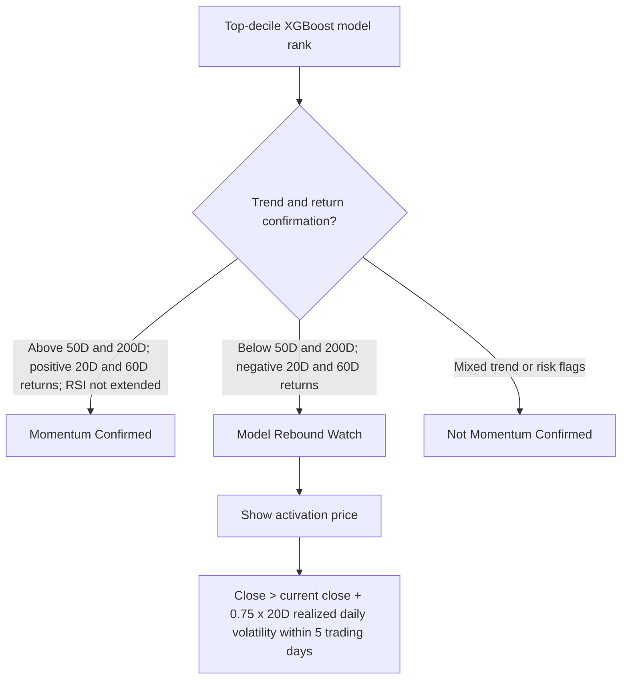
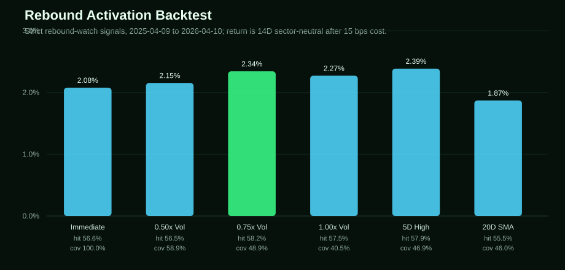

# Rebound Activation Research

This note documents why Market Pulse separates high-ranked rebound candidates from confirmed momentum plays, and why the dashboard uses a volatility-adjusted activation price for those names.

The practical goal is simple: when the XGBoost model ranks a broken chart highly, the dashboard should not call it a clean momentum buy. It should tag it as a rebound watch and show the price level that would indicate buyers are starting to regain control.

## Research Basis

Classic cross-sectional momentum is a prior-winner strategy. Jegadeesh and Titman documented that buying past winners and selling past losers generated positive returns over 3- to 12-month holding periods. That supports treating strong prior price action as momentum confirmation, not treating recent losers as momentum simply because the model likes their risk/reward. Source: [Jegadeesh and Titman, 1993](https://www.bauer.uh.edu/rsusmel/phd/jegadeesh-titman93.pdf).

Short-term reversal is a different setup. The same literature distinguishes shorter-term contrarian/reversal effects from medium-term momentum. That is the bucket for names that are deeply down, volatile, and below major trend lines but still rank well in the model.

Trend-following research supports waiting for price confirmation. Hurst, Ooi, and Pedersen find broad historical evidence that time-series momentum has worked across asset classes and regimes, which supports requiring a visible price turn before calling a rebound active. Source: [A Century of Evidence on Trend-Following Investing](https://papers.ssrn.com/sol3/papers.cfm?abstract_id=2993026).

Technical pattern research supports quantifying chart signals instead of eyeballing them. Lo, Mamaysky, and Wang find that several technical indicators provide incremental information when systematically defined. Source: [NBER Working Paper 7613](https://www.nber.org/papers/w7613).

Momentum risk is state-dependent. Barroso and Santa-Clara show momentum risk can vary materially over time, reinforcing the need to label high-volatility setups carefully instead of treating every high-ranked name the same. Source: [Momentum Has Its Moments](https://papers.ssrn.com/sol3/papers.cfm?abstract_id=2041429).

## Setup Classification



The key distinction is that the model score is a ranking signal, while the setup tag explains the type of trade. A high model rank can mean clean momentum, or it can mean a washed-out rebound candidate with asymmetric short-term upside. The dashboard should show that difference plainly.

## Backtest Design

The backtest used the existing out-of-sample XGBoost rank-model predictions:

- Prediction file: `data/modeling/reports/xgboost_rank_sector14_feature_v2_tuned_test_predictions.csv`
- Feature file: `data/modeling/features/training_dataset.csv.gz`
- Date range: `2025-04-09` to `2026-04-10`
- Unique signal dates: `252`
- Return metric: 14-trading-day sector-neutral return after 15 bps round-trip cost
- Strict rebound-watch definition: top-decile model rank, below 50D and 200D moving averages, negative 20D and 60D returns

For each historical signal date, the test compared buying immediately versus waiting for the stock to close above a trigger level within an activation window. The preferred trigger family was:

```text
activation price = current close x (1 + k x 20D realized daily volatility)
```

The script that regenerates the results is:

```bash
.venv-model/bin/python scripts/modeling/backtest_rebound_activation.py
```

Generated artifacts:

- `data/modeling/reports/rebound_activation_backtest_rules.csv`
- `data/modeling/reports/rebound_activation_backtest_summary.json`
- `docs/rebound-activation-backtest.svg`

## Backtest Graphic



## Key Results

Strict rebound-watch group:

| Rule | Coverage | Avg 14D Sector-Neutral Return | Median | Hit Rate |
| --- | ---: | ---: | ---: | ---: |
| Buy immediately | 100.0% | 2.08% | 1.47% | 56.6% |
| 0.50x 20D vol, 5-day activation | 58.9% | 2.15% | 1.43% | 56.5% |
| 0.75x 20D vol, 5-day activation | 48.9% | 2.34% | 1.80% | 58.2% |
| 1.00x 20D vol, 5-day activation | 40.5% | 2.27% | 1.55% | 57.5% |
| Prior 5D closing high, 5-day activation | 46.9% | 2.39% | 1.69% | 57.9% |
| 20D SMA reclaim, 10-day activation | 46.0% | 1.87% | 1.46% | 55.5% |

Oversold strict rebound-watch group, using RSI at or below 35:

| Rule | Coverage | Avg 14D Sector-Neutral Return | Median | Hit Rate |
| --- | ---: | ---: | ---: | ---: |
| Buy immediately | 100.0% | 1.99% | 1.05% | 54.5% |
| 0.50x 20D vol, 5-day activation | 56.0% | 2.29% | 1.48% | 57.2% |
| 0.75x 20D vol, 5-day activation | 46.4% | 2.67% | 1.85% | 60.1% |
| 1.00x 20D vol, 5-day activation | 38.4% | 2.58% | 1.76% | 58.3% |

## Decision

Market Pulse uses this rule for `Model Rebound Watch` names:

```text
activation price = current close x (1 + 0.75 x 20D realized daily volatility)
activation window = 5 trading days
confirmation = close above activation price
```

This is the best balance from the test:

- It improved average and median 14D sector-neutral returns versus buying immediately.
- It improved hit rate, especially for oversold rebound candidates.
- It did not require a full 20D moving-average reclaim, which was often too far away for a 14-trading-day horizon.
- It was less restrictive than a 1.00x volatility trigger, which reduced coverage without improving results.

The dashboard calls this an activation price, not a buy price. If the name does not close above the activation level within the window, the setup should be refreshed and reassessed rather than treated as active.

## Caveats

The backtest uses end-of-day data. It does not model intraday buy stops, intraday liquidity, spread, borrow, options flow, tax impact, or position sizing.

The trigger is evaluated after a daily close. If a stock gaps above the trigger and closes materially higher, the backtest assumes entry at that close, which is conservative relative to a stop order but realistic for an end-of-day dashboard.

The sample is one recent out-of-sample year. The rule should be revisited after more live refreshes accumulate, and again after any major model retraining.
